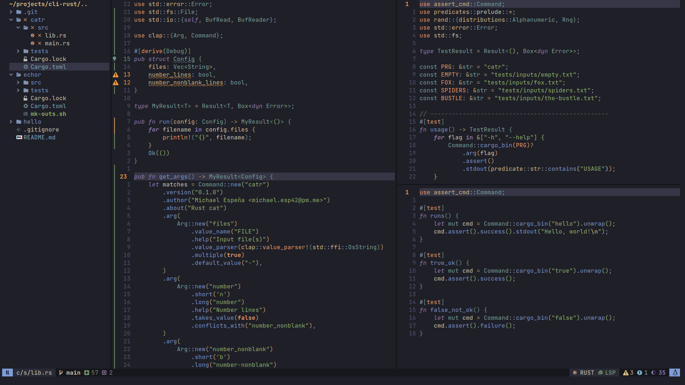

# Neovim Lua Configuration

## Dependencies

This configuration needs at least `NVIM v0.8.0` to work along with the external
dependencies listed in following subsections.

### Language Servers

- [Bash language server](https://github.com/bash-lsp/bash-language-server)
- [clangd](https://clangd.llvm.org/)
- [CSS language server](https://github.com/microsoft/vscode-css-languageservice)
- [Eclipse JDT language server](https://github.com/eclipse/eclipse.jdt.ls)
- [gopls](https://pkg.go.dev/golang.org/x/tools/gopls)
- [HTML language server](https://github.com/microsoft/vscode-html-languageservice)
- [JSON language server](https://github.com/microsoft/vscode-json-languageservice)
- [pyright](https://github.com/microsoft/pyright)
- [Rust Analyzer](https://rust-analyzer.github.io/)
- [Lua language server](https://github.com/sumneko/lua-language-server)
- [TexLab](https://github.com/latex-lsp/texlab)
- [Typescript language
  server](https://github.com/typescript-language-server/typescript-language-server)
- [vim language server](https://github.com/iamcco/vim-language-server)

### Linters

- [checkstyle](https://checkstyle.sourceforge.io/)
- [clang-tidy](https://clang.llvm.org/extra/clang-tidy/)
- [flake8](https://flake8.pycqa.org/)
- [golangcilint](https://github.com/golangci/golangci-lint)
- [luacheck](https://github.com/mpeterv/luacheck)
- [mypy](http://mypy-lang.org/)
- [pycodestyle](https://github.com/PyCQA/pycodestyle)
- [pydocstyle](https://github.com/PyCQA/pydocstyle)
- [pylint](https://pylint.org/)
- [revive](https://github.com/mgechev/revive)
- [shellcheck](https://www.shellcheck.net/)
- [vint](https://github.com/Vimjas/vint)
- [yamllint](http://www.yamllint.com/)
- [https://fennel-lang.org/](fennel)

### Formatters

- [black](https://github.com/psf/black)
- [clang-format](https://clang.llvm.org/docs/ClangFormat.html)
- [fnlfmt](https://git.sr.ht/~technomancy/fnlfmt)
- [gofmt](https://pkg.go.dev/cmd/gofmt)
- [latexindent](https://ctan.org/pkg/latexindent?lang=en)
- [prettier](https://prettier.io/)
- [rustfmt](https://rust-lang.github.io/rustfmt/)
- [shfmt](https://github.com/mvdan/sh)
- [stylua](https://github.com/JohnnyMorganz/StyLua)
- [taplo](https://taplo.tamasfe.dev/)
